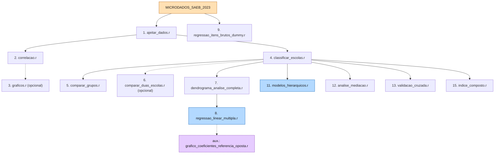

<div align="center">

# 🎓 TCC: Impacto Socioeconômico na Proficiência SAEB 2023

**Análise estatística dos microdados do SAEB 2023 — Minas Gerais**

[](https://www.r-project.org/)
[](https://www.gov.br/inep/pt-br/areas-de-atuacao/avaliacao-e-pesquisas-educacionais/saeb)
[]()
[](diario.md)
[](#-pipeline-de-execução)
[](#-convenção-de-pastas-datadas)
[]()
[]()
[]()
[]()
[](https://www.tidyverse.org/)

</div>

---

> 📌 **TL;DR**
> TCC de mestrado que modela o **impacto socioeconômico** sobre a **proficiência escolar**
> de alunos da 3ª série do EM em MG, usando o **INSE** como proxy socioeconômico.
> Pipeline de **15 passos** em R (tidyverse), cobrindo limpeza, análise de grupos,
> regressão linear, modelos hierárquicos, mediação, validação cruzada
> e PCA. Outputs organizados em **pastas datadas** `outputs/<YYYY-MM-DD>/<tipo>/`.
>
> **Setup rápido**: [R 4.6.1 instalado](#-instalação-de-r-e-dependências) → 
> `source("TESTE/1_LIMPEZA_E_TRANSFORMACAO/ajeitar_dados.r")` → próximos passos

---

## 🧑‍🎓 Cartões de estatística

| 🧑‍🎓 Alunos | 🏫 Escolas | 📍 Municípios | 🎯 Variáveis-alvo |
|----------:|----------:|-------------:|-------------------|
| 173.918   | 2.338     | 851 (MG)     | `MEDIA_MT` · `MEDIA_LP` |

| 📊 Proxy socioeconômica | 🧰 Pipeline | 📁 Saídas | 📜 Documentação |
|:---:|:---:|:---:|:---:|
| `INSE_ALUNO` (→ `INSE_MEDIO`) | 15 passos em R | pastas datadas | `TESTE/DOCUMENTACAO/` |

---

## 📑 Sumário

- [📋 Contexto](#-contexto)
- [🗂️ Estrutura](#️-estrutura)
- [⚙️ Instalação de R e Dependências](#️-instalação-de-r-e-dependências)
- [🚀 Pipeline de Execução](#-pipeline-de-execução)
- [📊 Resumo das Análises](#-resumo-das-análises)
- [📊 Resumo das Análises](#-resumo-das-análises)
- [✅ Progresso do Pipeline](#-progresso-do-pipeline)
- [🛣️ Detecção Automática de Caminhos](#️-detecção-automática-de-caminhos)
- [📅 Convenção de Pastas Datadas](#-convenção-de-pastas-datadas)
- [🎯 Variável `AREA_LOCAL`](#-variável-area_local)
- [📚 Documentação](#-documentação)
- [📝 Notas](#-notas)
- [📌 Convenções para contribuidores](#-convenções-para-contribuidores)
- [📜 Changelog](#-changelog)
- [🧭 Roadmap](#-roadmap)

---

## 📋 Contexto

**Ambiente**:
- **R**: 4.6.1 (2024-06-24) — instalado em `C:\Users\13756596699\AppData\Local\Programs\R\R-4.6.1`
- **OS**: Windows 10/11
- **Paradigma**: tidyverse (R moderno, pipe nativo `|>`)

**Dados e Amostra**:
- **Fonte**: INEP (Instituto Nacional de Estudos e Pesquisas Educacionais)
- **Dataset**: SAEB 2023 (Minas Gerais apenas)
- **Alunos**: 173.918 (3ª série do Ensino Médio)
- **Escolas**: 2.338 | **Municípios**: 851

**Disciplinas**:
- `MEDIA_MT` — Matemática (proficiência média por escola)
- `MEDIA_LP` — Língua Portuguesa (proficiência média por escola)

**Proxy socioeconômico**:
- `INSE_ALUNO` (score TRI do INEP, nível individual)
- `INSE_MEDIO` (agregado por escola, usada nos modelos)

> 💡 **Por que INSE e não itens brutos?**
> O INSE já é a síntese TRI dos 72 itens do questionário, com calibração psicométrica publicada.
> Usar os itens brutos diretos introduziria multicolinearidade severa e explosão dimensional inviável
> para regressão OLS. Detalhes: `TESTE/4_REGRESSAO_LINEAR/Scripts/regressao_linear_multipla.r`
> (bloco *NOTA METODOLOGICA - ESCOLHA DO INSE*).

---

## 🗂️ Estrutura

```
tcc/
├── README.md                    (este arquivo) ✨
├── diario.md                    (registro cronologico) 📓
├── AGENTS.md                    (convenções p/ agentes) 🤖
├── refs/                        (PDFs de referência) 📚
├── MICRODADOS_SAEB_2023/        (dados brutos INEP) 🔒
│   └── DADOS/TS_ALUNO_34EM.csv
└── TESTE/
    ├── DOCUMENTACAO/            🧰 helpers, dicionários, metodologia
    │   ├── utils_saeb.r         (caminho_saida, tema_saeb, dicionarios)
    │   ├── metodologia.md
    │   ├── referencia_outputs.md
    │   └── requisitos.md
    ├── 1_LIMPEZA_E_TRANSFORMACAO/      (PASSO 1)            ✅
    ├── 2_ANALISE_POR_ESCOLA/           (PASSO 2-3)          ✅
    ├── 3_ANALISE_DE_GRUPOS/            (PASSO 4-7)          ⏳ mig. pendente
    ├── 4_REGRESSAO_LINEAR/             (PASSO 8)            ✅
    ├── 5_REGRESSAO_ITENS_BRUTOS/       (PASSO 9)            ⏳ mig. pendente
    ├── 7_MODELOS_HIERARQUICOS/         (PASSO 11 — HLM)     ✅
    ├── 8_ANALISE_MEDIACAO/             (PASSO 12)           ✅
    ├── 9_VALIDACAO_CRUZADA/            (PASSO 13 — CV+ROC)  ✅
    └── 11_INDICE_COMPOSTO/             (PASSO 15 — PCA)     ✅
```

Legenda: ✅ migração concluída · ⏳ pendência Fase 3 (vide `diario.md`)

---

## ⚙️ Instalação de R e Dependências

### Verificar R instalado

```powershell
# Verificar versão (deve estar instalado em C:\Users\<user>\AppData\Local\Programs\R\R-4.x.x\)
& "C:\Users\13756596699\AppData\Local\Programs\R\R-4.6.1\bin\x64\Rscript.exe" --version

# Resultado esperado:
# Rscript (R) version 4.6.1 (2024-06-24)
```

### Instalar dependências via R

Execute uma **única vez** (no PowerShell ou RStudio):

```powershell
# Via PowerShell
C:\Users\13756596699\AppData\Local\Programs\R\R-4.6.1\bin\x64\R.exe --vanilla --quiet -e "install.packages(c('tidyverse','broom','patchwork','car','lmtest','shiny','dendextend','ggdendro'), repos='https://cloud.r-project.org'); cat('✓ All packages installed successfully!\n')"
```

Ou, **no RStudio**, cole na console:

```r
install.packages(c('tidyverse','broom','patchwork','car','lmtest','shiny','dendextend','ggdendro'))
```

**Dependências principais**:
| Pacote | Uso | Versão |
|--------|-----|--------|
| `tidyverse` | Manipulação de dados + ggplot2 | ≥ 1.3 |
| `broom` | Resumo de modelos (coeficientes, diagnósticos) | ≥ 0.8 |
| `patchwork` | Composição de múltiplos gráficos | ≥ 1.1 |
| `car` | Testes de multicolinearidade (VIF) | ≥ 3.1 |
| `lmtest` | Testes de regressão (Breusch-Pagan, etc.) | ≥ 0.9 |
| `shiny` | Dashboard interativo (opcional, PASSO 3) | ≥ 1.8 |
| `dendextend` | Dendrogramas coloridos (PASSO 7) | ≥ 1.15 |
| `ggdendro` | Wrapper ggplot2 para dendrogramas | ≥ 0.1 |

Detalhes completos: [`TESTE/DOCUMENTACAO/requisitos.md`](TESTE/DOCUMENTACAO/requisitos.md)

---



### Fase 1: Limpeza e Correlações (PASSO 1-3)

```r
source("TESTE/1_LIMPEZA_E_TRANSFORMACAO/ajeitar_dados.r")
source("TESTE/2_ANALISE_POR_ESCOLA/Scripts/correlacao.r")

# Opcional: dashboard Shiny interativo
shiny::runApp("TESTE/2_ANALISE_POR_ESCOLA/Scripts/graficos.r")
```

**Ou via terminal** (sem abrir R interativo):

```powershell
# PASSO 1
C:\Users\13756596699\AppData\Local\Programs\R\R-4.6.1\bin\x64\Rscript.exe TESTE/1_LIMPEZA_E_TRANSFORMACAO/ajeitar_dados.r

# PASSO 2
C:\Users\13756596699\AppData\Local\Programs\R\R-4.6.1\bin\x64\Rscript.exe TESTE/2_ANALISE_POR_ESCOLA/Scripts/correlacao.r

# PASSO 3 (opcional)
C:\Users\13756596699\AppData\Local\Programs\R\R-4.6.1\bin\x64\Rscript.exe TESTE/2_ANALISE_POR_ESCOLA/Scripts/graficos.r
```

### Fase 2: Análise de Grupos (PASSO 4-7)

```r
source("TESTE/3_ANALISE_DE_GRUPOS/Scripts/classificar_escolas.r")
source("TESTE/3_ANALISE_DE_GRUPOS/Scripts/comparar_grupos.r")
source("TESTE/3_ANALISE_DE_GRUPOS/Scripts/comparar_duas_escolas.r")  # opcional
source("TESTE/3_ANALISE_DE_GRUPOS/Scripts/dendrograma_analise_completa.r")
source("TESTE/3_ANALISE_DE_GRUPOS/Scripts/dendrograma_publica_vs_particular.r")
source("TESTE/3_ANALISE_DE_GRUPOS/Scripts/dendrograma_urbana_vs_rural.r")
source("TESTE/3_ANALISE_DE_GRUPOS/Scripts/dendrograma_capital_vs_interior.r")
source("TESTE/3_ANALISE_DE_GRUPOS/Scripts/dendrograma_area_local.r")
```

### Fase 3: Modelagem Preditiva (PASSO 8-9)

```r
source("TESTE/4_REGRESSAO_LINEAR/Scripts/regressao_linear_multipla.r")
source("TESTE/4_REGRESSAO_LINEAR/Scripts/grafico_coeficientes_referencia_oposta.r")  # aux.
source("TESTE/5_REGRESSAO_ITENS_BRUTOS/Scripts/regressao_itens_brutos_dummy.r")
```

### Fase 4: Análises Avançadas (PASSO 11-15)

```r
source("TESTE/7_MODELOS_HIERARQUICOS/Scripts/modelos_hierarquicos.r")
source("TESTE/8_ANALISE_MEDIACAO/Scripts/analise_mediacao.r")
source("TESTE/9_VALIDACAO_CRUZADA/Scripts/validacao_cruzada.r")
source("TESTE/11_INDICE_COMPOSTO/Scripts/indice_composto.r")
```

### Modelo central (PASSO 8)

O modelo principal é uma regressão linear múltipla com variáveis dummy:

$$
\text{Proficiencia}_i = \beta_0 + \beta_1 \cdot \text{INSE}_i^{(z)} + \beta_2 \cdot \text{Privada}_i + \sum_{k \in \text{AreaLocal}} \beta_k \cdot D_{ik} + \varepsilon_i
$$

com referências **`TIPO_ESCOLA = "Publica"`** e **`AREA_LOCAL = "Urbana_Capital"`**, e `INSE_MEDIO` normalizado por z-score. O script auxiliar `grafico_coeficientes_referencia_oposta.r` reajusta o mesmo modelo com a referência oposta (`Privada` + `Rural_Interior`).

---

## 📊 Resumo das Análises

| # | Fase | O que faz | Script principal | Figuras |
|---|------|-----------|------------------|---------|
| 1 | Limpeza | Transforma variáveis A/B/C → números | `ajeitar_dados.r` | — |
| 2 | Correlações | Spearman/Pearson por escola | `correlacao.r` | — |
| 3 | Dashboard | Shiny interativo (opcional) | `graficos.r` | — |
| 4 | Metadados | Agrega por escola | `classificar_escolas.r` | — |
| 5 | Comparações | Wilcoxon entre grupos | `comparar_grupos.r` | 1-4 |
| 6 | 2 escolas | Comparação lado a lado | `comparar_duas_escolas.r` | 5 |
| 7 | Clustering | Dendrogramas (Ward.D2) | `dendrograma_analise_completa.r` | 5 |
| 8 | Regressão | Modelos lineares (INSE) | `regressao_linear_multipla.r` | 6-14 |
| 9 | Itens brutos | Regressão com 72 itens | `regressao_itens_brutos_dummy.r` | 6-14 |
| 11 | HLM | Modelos hierárquicos | `modelos_hierarquicos.r` | 19-20 |
| 12 | Mediação | INSE como mediador | `analise_mediacao.r` | 21-22 |
| 13 | Validação CV | K-fold + ROC/AUC | `validacao_cruzada.r` | 23-25 |
| 15 | Índice composto | PCA + indicador próprio | `indice_composto.r` | 29-31 |

> 📝 **Notas metodológicas**: Os scripts dos PASSOS 7, 8, 9 e 11-15 trazem blocos `# NOTA METODOLOGICA - ...`
> no cabeçalho justificando decisões substantivas (escolha do INSE, HLM, mediacao bootstrap,
> k-fold vs LOO, retenção de componentes em PCA, etc.).

---

## ✅ Progresso do Pipeline

| Passo | Fase | Script | Status |
|:-----:|:----:|--------|:------:|
| 1 | Limpeza | `ajeitar_dados.r` | ✅ |
| 2-3 | Correlações / Dashboard | `correlacao.r` · `graficos.r` | ✅ |
| 4-7 | Análise de grupos | `classificar_escolas.r` + 3 | ⏳ mig. `caminho_saida()` |
| 8 | Regressão linear | `regressao_linear_multipla.r` | ✅ |
| 8b | Regressão (ref. oposta) | `grafico_coeficientes_referencia_oposta.r` | ✅ |
| 9 | Itens brutos | `regressao_itens_brutos_dummy.r` | ⏳ mig. `caminho_saida()` |
| 11 | HLM | `modelos_hierarquicos.r` | ✅ |
| 12 | Mediação | `analise_mediacao.r` | ✅ |
| 13 | Validação CV | `validacao_cruzada.r` | ✅ |
| 15 | PCA | `indice_composto.r` | ✅ |

Legenda: ✅ concluído · ⏳ migração parcial pendente (Fase 3, vide `diario.md`)

---

## 🛣️ Detecção Automática de Caminhos

Todos os scripts detectam automaticamente a pasta raiz do projeto (função `detectar_raiz()`) — funciona em qualquer computador, independente do nome da pasta de usuário. Não há caminhos absolutos hard-coded.

---

## 📅 Convenção de Pastas Datadas

> 🔧 **Convenção** (refatoração julho/2026): todos os outputs vão para
> `<modulo>/outputs/<YYYY-MM-DD>/<tipo>/<nome>_<HHMMSS>.<ext>` via helper
> `caminho_saida()`. Nunca escrever direto em `outputs/tabelas/`, `outputs/figuras/`, etc.

**Helpers compartilhados** (`TESTE/DOCUMENTACAO/utils_saeb.r`):

| Helper | Descrição |
|--------|-----------|
| `caminho_saida(DIR_BASE, subpasta, nome, ext)` | Gera `outputs/<YYYY-MM-DD>/<subpasta>/<nome>_<HHMMSS>.<ext>` e cria a pasta automaticamente |
| `encontrar_arquivo_mais_recente(pasta, nome_base, tipo)` | Localiza arquivo mais recente (suporta pastas datadas + fallback do padrão antigo com sufixo `_YYYYMMDD_HHMMSS`) |
| `detectar_raiz()` | Sobe diretórios até achar `TESTE/` |
| `tema_saeb()` + paletas | Tema ggplot2 centralizado (`PALETA_PUBLICA_PRIVADA`, `PALETA_INSE`, etc.) |

```r
# Exemplo de uso
source(file.path(RAIZ, "TESTE", "DOCUMENTACAO", "utils_saeb.r"))
write_csv(coef, caminho_saida(DIR_BASE, "tabelas", "coeficientes_MT", "csv"))
arq <- encontrar_arquivo_mais_recente(DIR_OUTPUTS, "base_escolas_agregada", "tabelas")
```

---

## 🎯 Variável `AREA_LOCAL`

> 🧩 **Decisão** (refatoração julho/2026): os modelos de regressão NÃO usam mais `AREA`
> e `LOCALIZACAO` como preditores separados. Usam a variável combinada `AREA_LOCAL`
> (4 categorias), que captura a interação urbano/rural × capital/interior identificada
> como lacuna na apresentação do TCC.

| Categoria | Composição | Frequência esperada |
|-----------|------------|---------------------|
| `Urbana_Capital` |urbana + Belo Horizonte/Capital | alta (referência) |
| `Urbana_Interior` |urbana + demais municípios | dominante |
| `Rural_Capital` | rural + Capital | baixa |
| `Rural_Interior` | rural + Interior | moderada |

- **Modelo principal**: `TIPO_ESCOLA = "Publica"` + `AREA_LOCAL = "Urbana_Capital"`.
- **Script auxiliar** (`grafico_coeficientes_referencia_oposta.r`): mesmo gráfico com referência oposta (`Privada` + `Rural_Interior`); ponto de quebra do eixo X calculado dinamicamente a partir dos ICs 95%.
- `AREA` e `LOCALIZACAO` permanecem disponíveis para referência descritiva.

---

## 📚 Documentação

| Arquivo | Conteúdo |
|---------|----------|
| [TESTE/DOCUMENTACAO/README.md](TESTE/DOCUMENTACAO/README.md) | Guia de uso completo |
| [TESTE/DOCUMENTACAO/metodologia.md](TESTE/DOCUMENTACAO/metodologia.md) | Base para escrever o TCC |
| [TESTE/DOCUMENTACAO/referencia_outputs.md](TESTE/DOCUMENTACAO/referencia_outputs.md) | Dicionário de CSVs gerados |
| [TESTE/DOCUMENTACAO/requisitos.md](TESTE/DOCUMENTACAO/requisitos.md) | Dependências e instalação |
| [AGENTS.md](AGENTS.md) | 🤖 Convenções para contribuidores e agentes |
| [diario.md](diario.md) | 📓 Histórico cronológico de mudanças |

---

## 📝 Notas

- ✅ Todos os outputs usam timestamp (não sobrescrevem)
- ✅ Caminhos usam `/` (não `\`)
- ✅ PASSO 5 gera comparações bidirecionais (Pública→Privada E Privada→Pública)
- ✅ Gráficos em DPI 600, fundo branco (qualidade para impressão)
- ✅ Convenção sem acentos em strings/mensagens R (encoding Windows/UTF-8/Latin1)
- ✅ Notas metodológicas nos scripts de decisão substantiva (PASSOS 7, 8, 9, 11-15)
- ✅ Scripts executáveis via `Rscript` sem abrir R interativo
- ✅ Detecção automática de caminhos em qualquer computador (função `detectar_raiz()`)

---

## 📌 Convenções para contribuidores

Antes de editar código ou documentação, leia [`AGENTS.md`](AGENTS.md). Resumo rápido:

- 📁 Outputs sempre em pastas datadas (`caminho_saida()`)
- 🚫 Sem caminhos absolutos hard-coded (`C:/Users/...`)
- 🎯 `AREA_LOCAL` combinada nos modelos de regressão
- 🔡 Sem acentos em strings R
- 📓 Atualize `diario.md` ao final de cada sessão significativa
- 🚀 Commits em português: `feat:`, `fix:`, `refactor:`, `docs:`

---

## 📜 Changelog

| Data | Versão | Mudanças |
|------|:------:|--------------------|
| Maio 2026 | 1.0 | Estrutura inicial, 9 scripts |
| Maio 2026 | 2.0 | Regressão linear + itens brutos + 3 guias |
| Julho 2026 | 2.1 | `utils_saeb.r` + pastas datadas + `AREA_LOCAL` |
| Julho 2026 | 2.2 | Migração de outputs antigos (mod 3, 4, 5) + script auxiliar ref. oposta |
| Julho 2026 | **3.0** | ✨ Fix bugs de encoding (`P?blica`) + `MODO` indefinido + notas metodológicas (mod 6-11) + README brilhoso máximo |
| Julho 2026 | **3.1** | 🗑️ Remoção módulos 6 (mapas) e 10 (Moran's I) — dados SAEB anonimizam municípios, inviabilizando análises espaciais |

Detalhes completos: [`diario.md`](diario.md)

---

## 🧭 Roadmap

- [ ] **Fase 3**: migrar scripts dos módulos 3 e 5 para `caminho_saida()` (estilo antigo → datado)
- [ ] **Convenção**: migrar `AREA_LOCAL` no módulo 11 (ainda usa `LOCAL_RURAL`/`TIPO_PRIVADA` separados)
- [ ] **Limpeza**: remover acentos e emojis dos scripts dos módulos 1 e 2
- [ ] **Redação**: integrar resultados na escrita final do TCC

---

<div align="center">

**Versão**: 3.0 (refatoração julho/2026 — pastas datadas, `AREA_LOCAL`, README brilhoso máximo)
**Última atualização**: 23 de Julho de 2026 — vide [`diario.md`](diario.md)

Feito com muito ☕ · Pipeline R · SAEB 2023 · Minas Gerais

</div>