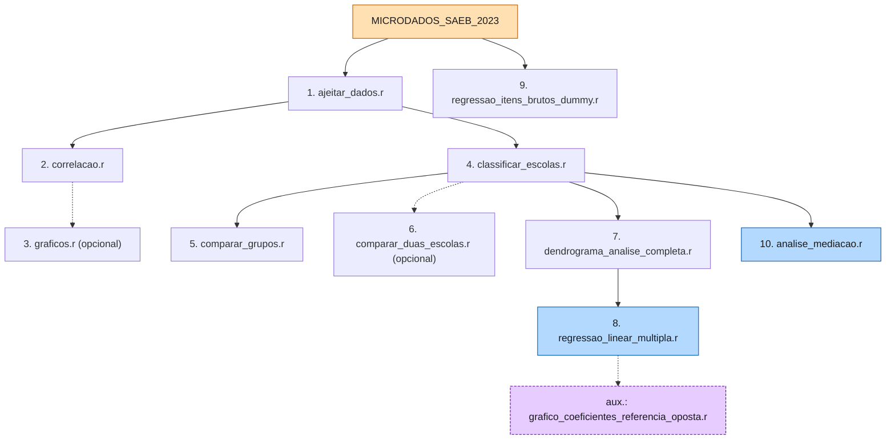

<div align="center">

# TCC: Impacto Socioeconômico na Proficiência — SAEB 2023

**Análise estatística dos microdados do SAEB 2023 — Minas Gerais**

[](https://www.r-project.org/)
[](https://www.gov.br/inep/pt-br/areas-de-atuacao/avaliacao-e-pesquisas-educacionais/saeb)
[]()
[](diario.md)
[](#pipeline-de-execução)
[](#convenção-de-pastas-datadas)
[]()
[]()
[]()
[]()
[](https://www.tidyverse.org/)

</div>

---

> **TL;DR**
> TCC de mestrado que modela o **impacto socioeconômico** sobre a **proficiência escolar**
> de alunos da 3ª série do Ensino Médio em MG, usando o **INSE** como proxy socioeconômico.
> Pipeline de **10 passos** em R (tidyverse), cobrindo limpeza, análise de grupos,
> regressão linear, regressão por itens brutos e análise de mediação (INSE como
> mediador). Outputs organizados em **pastas datadas** `outputs/<YYYY-MM-DD>/<tipo>/`.
>
> **Setup rápido**: [instale o R 4.x e as dependências](#instalação-de-r-e-dependências) →
> `source("TESTE/1_LIMPEZA_E_TRANSFORMACAO/ajeitar_dados.r")` → siga o [pipeline completo](#pipeline-de-execução)

---

## Cartões de estatística

| Alunos    | Escolas   | Municípios   | Variáveis-alvo          |
|----------:|----------:|-------------:|--------------------------|
| 173.918   | 2.338     | 851 (MG)     | `MEDIA_MT` · `MEDIA_LP` |

| Proxy socioeconômico              | Pipeline        | Saídas         | Documentação           |
|:----------------------------------:|:---------------:|:--------------:|:-----------------------:|
| `INSE_ALUNO` (→ `INSE_MEDIO`)      | 10 passos em R  | pastas datadas | `TESTE/DOCUMENTACAO/` |

---

## Sumário

- [Contexto](#contexto)
- [Estrutura](#estrutura)
- [Instalação de R e Dependências](#instalação-de-r-e-dependências)
- [Pipeline de Execução](#pipeline-de-execução)
- [Resumo das Análises](#resumo-das-análises)
- [Progresso do Pipeline](#progresso-do-pipeline)
- [Detecção Automática de Caminhos](#detecção-automática-de-caminhos)
- [Convenção de Pastas Datadas](#convenção-de-pastas-datadas)
- [Variável `AREA_LOCAL`](#variável-area_local)
- [Documentação](#documentação)
- [Boas Práticas Adotadas](#boas-práticas-adotadas)
- [Convenções para Contribuidores](#convenções-para-contribuidores)
- [Como Citar](#como-citar)
- [Changelog](#changelog)
- [Roadmap](#roadmap)

---

## Contexto

**Ambiente**

| Item        | Detalhe                                         |
|-------------|--------------------------------------------------|
| Linguagem   | R 4.x — detectado automaticamente via `detectar_raiz()` |
| SO          | Windows 10/11                                    |
| Paradigma   | tidyverse (R moderno, pipe nativo `\|>`)           |

**Dados e amostra**

- **Fonte**: INEP (Instituto Nacional de Estudos e Pesquisas Educacionais)
- **Dataset**: SAEB 2023 (apenas Minas Gerais)
- **Alunos**: 173.918 (3ª série do Ensino Médio)
- **Escolas**: 2.338 | **Municípios**: 851

**Disciplinas (variáveis-alvo)**

- `MEDIA_MT` — Matemática (proficiência média por escola)
- `MEDIA_LP` — Língua Portuguesa (proficiência média por escola)

**Proxy socioeconômico**

- `INSE_ALUNO` — score TRI do INEP, nível individual
- `INSE_MEDIO` — agregado por escola, usado nos modelos

> **Por que INSE e não os itens brutos do questionário?**
> O INSE já é a síntese TRI dos 72 itens do questionário socioeconômico, com calibração
> psicométrica publicada pelo INEP. Usar os itens brutos diretamente introduziria
> multicolinearidade severa e explosão dimensional inviável para uma regressão OLS.
> Detalhes completos em `TESTE/4_REGRESSAO_LINEAR/Scripts/regressao_linear_multipla.r`
> (bloco *NOTA METODOLÓGICA — ESCOLHA DO INSE*). A Fase 9 (`regressao_itens_brutos_dummy.r`)
> faz a exploração complementar com os 72 itens brutos.

---

## Estrutura

```text
tcc/
├── README.md                          (este arquivo)
├── diario.md                          (registro cronológico do projeto)
├── AGENTS.md                          (convenções para contribuidores/agentes)
├── refs/                              (PDFs de referência bibliográfica)
├── MICRODADOS_SAEB_2023/              (dados brutos do INEP)
│   └── DADOS/TS_ALUNO_34EM.csv
└── TESTE/
    ├── DOCUMENTACAO/                  helpers, dicionários, metodologia
    │   ├── utils_saeb.r               (caminho_saida, tema_saeb, dicionários)
    │   ├── metodologia.md
    │   ├── referencia_outputs.md
    │   └── requisitos.md
    ├── 1_LIMPEZA_E_TRANSFORMACAO/     (PASSO 1)                ✅
    ├── 2_ANALISE_POR_ESCOLA/          (PASSO 2-3)              ✅
    ├── 3_ANALISE_DE_GRUPOS/           (PASSO 4-7)              ⏳ migração pendente
    ├── 4_REGRESSAO_LINEAR/            (PASSO 8)                ✅
    ├── 5_REGRESSAO_ITENS_BRUTOS/      (PASSO 9)                ✅
    └── 6_ANALISE_MEDIACAO/            (PASSO 10)               ✅
```

**Legenda**: ✅ migração concluída · ⏳ pendência da Fase 3 (ver `diario.md`)

> **Módulos removidos**: os módulos de **HLM** (modelos hierárquicos), **validação
> cruzada + ROC** e **índice composto (PCA)** foram retirados do pipeline. O TCC
> passou a focar no eixo limpeza → agrupamento → regressão → mediação. Ver a
> entrada de agosto/2026 em `diario.md` para o racional completo.

---

## Instalação de R e Dependências

### 1. Verificar se o R está instalado

```powershell
Rscript --version
# Resultado esperado: Rscript (R) version 4.x
```

### 2. Instalar as dependências

Execute **uma única vez**, no PowerShell:

```powershell
R --vanilla --quiet -e "install.packages(c('tidyverse','data.table','caret','broom','patchwork','car','lmtest','shiny','dendextend','ggdendro','mediation','boot'), repos='https://cloud.r-project.org'); cat('OK pacotes instalados\n')"
```

Ou, no console do RStudio:

```r
install.packages(c('tidyverse','data.table','caret','broom','patchwork',
                    'car','lmtest','shiny','dendextend','ggdendro',
                    'mediation','boot'))
```

### 3. Dependências principais

| Pacote        | Uso                                             | Versão  |
|---------------|--------------------------------------------------|:-------:|
| `tidyverse`   | Manipulação de dados + ggplot2                   | ≥ 1.3   |
| `data.table`  | Leitura rápida de CSVs grandes                   | ≥ 1.14  |
| `caret`       | `nearZeroVar`, pré-processamento                 | ≥ 6.0   |
| `broom`       | Resumo de modelos (coeficientes, diagnósticos)   | ≥ 0.8   |
| `patchwork`   | Composição de múltiplos gráficos                 | ≥ 1.1   |
| `car`         | Testes de multicolinearidade (VIF)               | ≥ 3.1   |
| `lmtest`      | Testes de regressão (Breusch-Pagan, etc.)        | ≥ 0.9   |
| `shiny`       | Dashboard interativo (Passo 3)                   | ≥ 1.8   |
| `dendextend`  | Dendrogramas coloridos (Passo 7)                 | ≥ 1.15  |
| `ggdendro`    | Wrapper ggplot2 para dendrogramas                | ≥ 0.1   |
| `mediation`   | Análise de mediação por bootstrap (Passo 10)     | ≥ 4.5   |
| `boot`        | Bootstrap (Passo 10)                              | ≥ 1.3   |

Detalhes completos em [`TESTE/DOCUMENTACAO/requisitos.md`](TESTE/DOCUMENTACAO/requisitos.md).

---

## Pipeline de Execução



### Fase 1 — Limpeza e correlações (Passos 1-3)

```r
source("TESTE/1_LIMPEZA_E_TRANSFORMACAO/ajeitar_dados.r")
source("TESTE/2_ANALISE_POR_ESCOLA/Scripts/correlacao.r")

# Opcional: dashboard Shiny interativo
shiny::runApp("TESTE/2_ANALISE_POR_ESCOLA/Scripts/graficos.r")
```

Ou via terminal, sem abrir o R interativo:

```powershell
Rscript TESTE/1_LIMPEZA_E_TRANSFORMACAO/ajeitar_dados.r          # Passo 1
Rscript TESTE/2_ANALISE_POR_ESCOLA/Scripts/correlacao.r          # Passo 2
Rscript TESTE/2_ANALISE_POR_ESCOLA/Scripts/graficos.r            # Passo 3 (opcional)
```

### Fase 2 — Análise de grupos (Passos 4-7)

```r
source("TESTE/3_ANALISE_DE_GRUPOS/Scripts/classificar_escolas.r")
source("TESTE/3_ANALISE_DE_GRUPOS/Scripts/comparar_grupos.r")
source("TESTE/3_ANALISE_DE_GRUPOS/Scripts/comparar_duas_escolas.r")       # opcional
source("TESTE/3_ANALISE_DE_GRUPOS/Scripts/dendrograma_analise_completa.r")
source("TESTE/3_ANALISE_DE_GRUPOS/Scripts/dendrograma_publica_vs_particular.r")
source("TESTE/3_ANALISE_DE_GRUPOS/Scripts/dendrograma_urbana_vs_rural.r")
source("TESTE/3_ANALISE_DE_GRUPOS/Scripts/dendrograma_capital_vs_interior.r")
source("TESTE/3_ANALISE_DE_GRUPOS/Scripts/dendrograma_area_local.r")
```

### Fase 3 — Modelagem preditiva (Passos 8-9)

```r
source("TESTE/4_REGRESSAO_LINEAR/Scripts/regressao_linear_multipla.r")
source("TESTE/4_REGRESSAO_LINEAR/Scripts/grafico_coeficientes_referencia_oposta.r")  # aux.
source("TESTE/5_REGRESSAO_ITENS_BRUTOS/Scripts/regressao_itens_brutos_dummy.r")
```

### Fase 4 — Análise de mediação (Passo 10)

```r
source("TESTE/6_ANALISE_MEDIACAO/Scripts/analise_mediacao.r")
```

### Modelo central (Passo 8)

O modelo principal é uma regressão linear múltipla com variáveis dummy:

$$
\text{Proficiência}_i = \beta_0 + \beta_1 \cdot \text{INSE}_i^{(z)} + \beta_2 \cdot \text{Privada}_i + \sum_{k \in \text{AreaLocal}} \beta_k \cdot D_{ik} + \varepsilon_i
$$

com categorias de referência **`TIPO_ESCOLA = "Publica"`** e **`AREA_LOCAL = "Urbana_Capital"`**,
e `INSE_MEDIO` normalizado por z-score. O script auxiliar
`grafico_coeficientes_referencia_oposta.r` reajusta o mesmo modelo com a referência
oposta (`Privada` + `Rural_Interior`), útil para checar a robustez dos coeficientes
frente à escolha da categoria-base.

---

## Resumo das Análises

| # | Fase          | O que faz                        | Script principal                          | Figuras |
|---|---------------|-----------------------------------|--------------------------------------------|:-------:|
| 1 | Limpeza       | Transforma variáveis A/B/C → números | `ajeitar_dados.r`                        | —       |
| 2 | Correlações   | Spearman/Pearson por escola        | `correlacao.r`                             | —       |
| 3 | Dashboard     | Shiny interativo (opcional)        | `graficos.r`                               | —       |
| 4 | Metadados     | Agrega por escola                  | `classificar_escolas.r`                    | —       |
| 5 | Comparações   | Wilcoxon entre grupos              | `comparar_grupos.r`                        | 1-4     |
| 6 | 2 escolas     | Comparação lado a lado             | `comparar_duas_escolas.r`                  | 5       |
| 7 | Clustering    | Dendrogramas (Ward.D2)             | `dendrograma_analise_completa.r`            | 5       |
| 8 | Regressão     | Modelos lineares (INSE)            | `regressao_linear_multipla.r`              | 6-14    |
| 9 | Itens brutos  | Regressão com os 72 itens          | `regressao_itens_brutos_dummy.r`           | 6-14    |
| 10| Mediação      | INSE como mediador                 | `analise_mediacao.r`                       | 21-22   |

> **Notas metodológicas**: os scripts dos Passos 7, 8, 9 e 10 trazem blocos
> `# NOTA METODOLOGICA - ...` no cabeçalho, justificando decisões substantivas
> (escolha do INSE, uso de dummies, mediação via bootstrap, etc.).

---

## Progresso do Pipeline

| Passo | Fase                       | Script                                        | Status |
|:-----:|-----------------------------|------------------------------------------------|:------:|
| 1     | Limpeza                     | `ajeitar_dados.r`                              | ✅     |
| 2-3   | Correlações / Dashboard      | `correlacao.r` · `graficos.r`                  | ✅     |
| 4-7   | Análise de grupos            | `classificar_escolas.r` + 3 scripts            | ⏳ migração pendente de `caminho_saida()` |
| 8     | Regressão linear             | `regressao_linear_multipla.r`                  | ✅     |
| 8b    | Regressão (ref. oposta)      | `grafico_coeficientes_referencia_oposta.r`     | ✅     |
| 9     | Itens brutos                 | `regressao_itens_brutos_dummy.r`               | ✅     |
| 10    | Mediação                     | `analise_mediacao.r`                           | ✅     |

**Legenda**: ✅ concluído · ⏳ migração parcial pendente (Fase 3 — ver `diario.md`)

---

## Detecção Automática de Caminhos

Todos os scripts detectam automaticamente a pasta raiz do projeto por meio da função
`detectar_raiz()` — funciona em qualquer computador, independente do nome da pasta de
usuário. Não há caminhos absolutos fixos no código (nada de `C:/Users/...`).

---

## Convenção de Pastas Datadas

> **Convenção** (refatoração de julho/2026): todos os outputs vão para
> `<módulo>/outputs/<YYYY-MM-DD>/<tipo>/<nome>_<HHMMSS>.<ext>`, gerados pelo helper
> `caminho_saida()`. Nunca escrever diretamente em `outputs/tabelas/`, `outputs/figuras/` etc.

**Helpers compartilhados** (`TESTE/DOCUMENTACAO/utils_saeb.r`)

| Helper                                              | Descrição                                                                 |
|------------------------------------------------------|------------------------------------------------------------------------|
| `caminho_saida(DIR_BASE, subpasta, nome, ext)`       | Gera `outputs/<YYYY-MM-DD>/<subpasta>/<nome>_<HHMMSS>.<ext>` e cria a pasta automaticamente |
| `encontrar_arquivo_mais_recente(pasta, nome_base, tipo)` | Localiza o arquivo mais recente (pastas datadas + fallback do padrão antigo com sufixo `_YYYYMMDD_HHMMSS`) |
| `detectar_raiz()`                                    | Sobe diretórios até encontrar `TESTE/`                                  |
| `tema_saeb()` + paletas                              | Tema ggplot2 centralizado (`PALETA_PUBLICA_PRIVADA`, `PALETA_INSE`, etc.) |

```r
# Exemplo de uso
source(file.path(RAIZ, "TESTE", "DOCUMENTACAO", "utils_saeb.r"))
write_csv(coef, caminho_saida(DIR_BASE, "tabelas", "coeficientes_MT", "csv"))
arq <- encontrar_arquivo_mais_recente(DIR_OUTPUTS, "base_escolas_agregada", "tabelas")
```

---

## Variável `AREA_LOCAL`

> **Decisão** (refatoração de julho/2026): os modelos de regressão não usam mais `AREA`
> e `LOCALIZACAO` como preditores separados. Em vez disso, usam a variável combinada
> `AREA_LOCAL` (4 categorias), que captura a interação urbano/rural × capital/interior —
> identificada como lacuna na apresentação do TCC.

| Categoria         | Composição                          | Frequência esperada     |
|-------------------|--------------------------------------|--------------------------|
| `Urbana_Capital`  | urbana + Belo Horizonte/Capital       | alta (referência)        |
| `Urbana_Interior` | urbana + demais municípios            | dominante                 |
| `Rural_Capital`   | rural + Capital                       | baixa                     |
| `Rural_Interior`  | rural + Interior                      | moderada                  |

- **Modelo principal**: `TIPO_ESCOLA = "Publica"` + `AREA_LOCAL = "Urbana_Capital"`.
- **Script auxiliar** (`grafico_coeficientes_referencia_oposta.r`): mesmo gráfico com
  referência oposta (`Privada` + `Rural_Interior`); o ponto de quebra do eixo X é
  calculado dinamicamente a partir dos intervalos de confiança de 95%.
- A análise de mediação (Passo 10) também usa `AREA_LOCAL` (3 dummies, ref.
  `Urbana_Capital`), além de `TIPO_ESCOLA`.
- `AREA` e `LOCALIZACAO` continuam disponíveis para referência descritiva.

---

## Documentação

| Arquivo                                                                  | Conteúdo                             |
|---------------------------------------------------------------------------|----------------------------------------|
| [TESTE/DOCUMENTACAO/README.md](TESTE/DOCUMENTACAO/README.md)              | Guia de uso completo                   |
| [TESTE/DOCUMENTACAO/metodologia.md](TESTE/DOCUMENTACAO/metodologia.md)    | Base para escrever o TCC               |
| [TESTE/DOCUMENTACAO/referencia_outputs.md](TESTE/DOCUMENTACAO/referencia_outputs.md) | Dicionário dos CSVs gerados |
| [TESTE/DOCUMENTACAO/requisitos.md](TESTE/DOCUMENTACAO/requisitos.md)      | Dependências e instalação              |
| [AGENTS.md](AGENTS.md)                                                    | Convenções para contribuidores/agentes |
| [diario.md](diario.md)                                                    | Histórico cronológico de mudanças      |

---

## Boas Práticas Adotadas

- ✅ Todos os outputs usam timestamp (nunca sobrescrevem resultados anteriores)
- ✅ Caminhos usam `/` (não `\`), portáveis entre SOs
- ✅ O Passo 5 gera comparações bidirecionais (Pública→Privada **e** Privada→Pública)
- ✅ Gráficos em 600 DPI, fundo branco (qualidade de impressão)
- ✅ Convenção sem acentos em strings/mensagens do R (compatibilidade Windows/UTF-8/Latin1)
- ✅ Notas metodológicas nos scripts de decisão substantiva (Passos 7, 8, 9, 10)
- ✅ Scripts executáveis via `Rscript`, sem precisar abrir o R interativo
- ✅ Detecção automática de caminhos em qualquer computador (`detectar_raiz()`)

---

## Convenções para Contribuidores

Antes de editar código ou documentação, leia [`AGENTS.md`](AGENTS.md). Resumo rápido:

- 📁 Outputs sempre em pastas datadas (`caminho_saida()`)
- 🚫 Sem caminhos absolutos fixos no código (`C:/Users/...`)
- 🎯 Usar a variável combinada `AREA_LOCAL` nos modelos de regressão
- 🔡 Sem acentos em strings do R
- 📓 Atualizar `diario.md` ao final de cada sessão significativa
- 🚀 Commits em português, seguindo `feat:`, `fix:`, `refactor:`, `docs:`

---

## Como Citar

Se este repositório for referenciado em outro trabalho, sugestão de citação:

```
[SOBRENOME, Nome]. Impacto socioeconômico na proficiência escolar: uma análise dos
microdados do SAEB 2023 em Minas Gerais. Trabalho de Conclusão de Curso — [Instituição],
[Ano]. Repositório de código: [URL do repositório].
```

> Ajuste os campos entre colchetes com os dados finais de autoria, instituição e ano de defesa.

---

## Changelog

| Data       | Versão | Mudanças                                                                                       |
|------------|:------:|--------------------------------------------------------------------------------------------------|
| Maio 2026  | 1.0    | Estrutura inicial, 9 scripts                                                                     |
| Maio 2026  | 2.0    | Regressão linear + itens brutos + 3 guias                                                        |
| Julho 2026 | 2.1    | `utils_saeb.r` + pastas datadas + `AREA_LOCAL`                                                    |
| Julho 2026 | 2.2    | Migração de outputs antigos (módulos 3, 4, 5) + script auxiliar de referência oposta             |
| Julho 2026 | 3.0    | Correção de bugs de encoding (`P?blica`) + `MODO` indefinido + notas metodológicas (módulos 6-11) |
| Julho 2026 | 3.1    | Remoção dos módulos 6 (mapas) e 10 (Moran's I) — dados do SAEB anonimizam municípios              |
| Julho 2026 | 3.2    | Renumeração sequencial (1-9) após remoção dos módulos 6 e 10                                      |
| Ago 2026   | **4.0** | Foco no eixo principal: remoção de HLM (Passo 11), validação cruzada (13) e PCA (15); `7_ANALISE_MEDIACAO` renomeado para `6_ANALISE_MEDIACAO`; pipeline reorganizado em **10 passos**; módulo 5 migrado para `caminho_saida()`; documentação atualizada |

Detalhes completos em [`diario.md`](diario.md).

---

## Roadmap

- [ ] **Fase 3**: migrar os scripts do módulo 3 para `caminho_saida()` (estilo antigo → datado)
- [ ] **Limpeza**: remover acentos e emojis dos scripts dos módulos 1 e 2
- [ ] **Ordem de `source`**: corrigir a chamada de `detectar_raiz()` antes de `source(utils_saeb.r)` no módulo 6
- [ ] **Figuras**: renumerar as figuras do Passo 10 (21-22 → 15-16) para sequência contínua
- [ ] **Redação**: integrar os resultados na escrita final do TCC

---

<div align="center">

**Versão**: 4.0 (refatoração ago/2026 — pipeline enxuto de 10 passos, módulos HLM/CV/PCA removidos, mediação renumerada para o módulo 6)
**Última atualização**: 21 de agosto de 2026 — ver [`diario.md`](diario.md)

Feito com muito café · Pipeline R · SAEB 2023 · Minas Gerais

</div>
