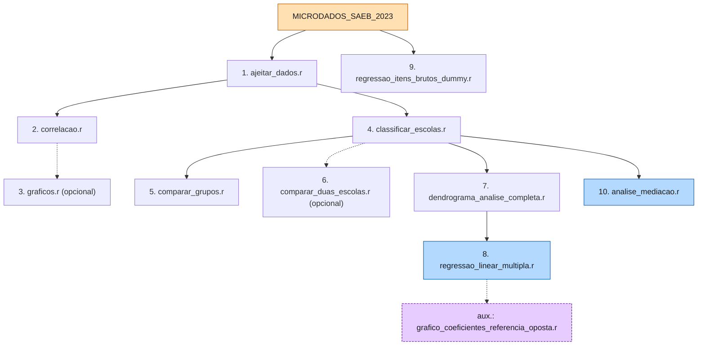

<div align="center">

# TCC: Impacto Socioeconomico na Proficiencia SAEB 2023

**Analise estatistica dos microdados do SAEB 2023 — Minas Gerais**

[](https://www.r-project.org/)
[](https://www.gov.br/inep/pt-br/areas-de-atuacao/avaliacao-e-pesquisas-educacionais/saeb)
[]()
[](diario.md)
[](#-pipeline-de-execucao)
[](#-convencao-de-pastas-datadas)
[]()
[]()
[]()
[]()
[](https://www.tidyverse.org/)

</div>

---

> **TL;DR**
> TCC de mestrado que modela o **impacto socioeconomico** sobre a **proficiencia escolar**
> de alunos da 3a serie do EM em MG, usando o **INSE** como proxy socioeconomico.
> Pipeline de **10 passos** em R (tidyverse), cobrindo limpeza, analise de grupos,
> regressao linear, regressao por itens brutos e analise de mediacao (INSE como
> mediador). Outputs organizados em **pastas datadas** `outputs/<YYYY-MM-DD>/<tipo>/`.
>
> **Setup rapido**: [R 4.x instalado](#instalacao-de-r-e-dependencias) ->
> `source("TESTE/1_LIMPEZA_E_TRANSFORMACAO/ajeitar_dados.r")` -> proximos passos

---

## Cartoes de estatistica

| Alunos | Escolas | Municipios | Variaveis-alvo |
|----------:|----------:|-------------:|-------------------|
| 173.918   | 2.338     | 851 (MG)     | `MEDIA_MT` · `MEDIA_LP` |

| Proxy socioeconomico | Pipeline | Saidas | Documentacao |
|:---:|:---:|:---:|:---:|
| `INSE_ALUNO` (-> `INSE_MEDIO`) | 10 passos em R | pastas datadas | `TESTE/DOCUMENTACAO/` |

---

## Sumario

- [Contexto](#contexto)
- [Estrutura](#estrutura)
- [Instalacao de R e Dependencias](#instalacao-de-r-e-dependencias)
- [Pipeline de Execucao](#pipeline-de-execucao)
- [Resumo das Analises](#resumo-das-analises)
- [Progresso do Pipeline](#progresso-do-pipeline)
- [Detecao Automatica de Caminhos](#detecao-automatica-de-caminhos)
- [Convencao de Pastas Datadas](#convencao-de-pastas-datadas)
- [Variavel `AREA_LOCAL`](#variavel-area_local)
- [Documentacao](#documentacao)
- [Notas](#notas)
- [Convencoes para contribuidores](#convencoes-para-contribuidores)
- [Changelog](#changelog)
- [Roadmap](#roadmap)

---

## Contexto

**Ambiente**:
- **R**: 4.x — detectado automaticamente via `detectar_raiz()`
- **OS**: Windows 10/11
- **Paradigma**: tidyverse (R moderno, pipe nativo `|>`)

**Dados e Amostra**:
- **Fonte**: INEP (Instituto Nacional de Estudos e Pesquisas Educacionais)
- **Dataset**: SAEB 2023 (Minas Gerais apenas)
- **Alunos**: 173.918 (3a serie do Ensino Medio)
- **Escolas**: 2.338 | **Municipios**: 851

**Disciplinas**:
- `MEDIA_MT` — Matematica (proficiencia media por escola)
- `MEDIA_LP` — Lingua Portuguesa (proficiencia media por escola)

**Proxy socioeconomico**:
- `INSE_ALUNO` (score TRI do INEP, nivel individual)
- `INSE_MEDIO` (agregado por escola, usada nos modelos)

> **Por que INSE e nao itens brutos?**
> O INSE ja e a sintese TRI dos 72 itens do questionario, com calibracao psicometrica publicada.
> Usar os itens brutos diretos introduziria multicolinearidade severa e explosao dimensional inviavel
> para regressao OLS. Detalhes: `TESTE/4_REGRESSAO_LINEAR/Scripts/regressao_linear_multipla.r`
> (bloco *NOTA METODOLOGICA - ESCOLHA DO INSE*). A Fase 9 (`regressao_itens_brutos_dummy.r`)
> faz a exploracao complementar com os 72 itens.

---

## Estrutura

```
tcc/
+-- README.md                    (este arquivo)
+-- diario.md                    (registro cronologico)
+-- AGENTS.md                    (convencoes p/ agentes)
+-- refs/                        (PDFs de referencia)
+-- MICRODADOS_SAEB_2023/        (dados brutos INEP)
|   +-- DADOS/TS_ALUNO_34EM.csv
+-- TESTE/
    +-- DOCUMENTACAO/            helpers, dicionarios, metodologia
    |   +-- utils_saeb.r         (caminho_saida, tema_saeb, dicionarios)
    |   +-- metodologia.md
    |   +-- referencia_outputs.md
    |   +-- requisitos.md
    +-- 1_LIMPEZA_E_TRANSFORMACAO/      (PASSO 1)               ✅
    +-- 2_ANALISE_POR_ESCOLA/           (PASSO 2-3)             ✅
    +-- 3_ANALISE_DE_GRUPOS/            (PASSO 4-7)             ⏳ mig. pendente
    +-- 4_REGRESSAO_LINEAR/             (PASSO 8)               ✅
    +-- 5_REGRESSAO_ITENS_BRUTOS/       (PASSO 9)               ✅
    +-- 6_ANALISE_MEDIACAO/             (PASSO 10)             ✅
```

Legenda: ✅ migracao concluida · ⏳ pendencia Fase 3 (vide `diario.md`)

> **Modulos removidos**: os modulos de **HLM** (modelos hierarquicos), **validacao
> cruzada + ROC** e **indice composto (PCA)** foram retirados do pipeline. O TCC
> passou a focar no eixo limpeza -> agrupamento -> regressao -> mediacao. Vide
> `diario.md` (entrada de ago/2026) para detalhes.

---

## Instalacao de R e Dependencias

### Verificar R instalado

```powershell
# Verificar versao
Rscript --version

# Resultado esperado:
# Rscript (R) version 4.x
```

### Instalar dependencias via R

Execute uma **unica vez** (no PowerShell ou RStudio):

```powershell
R --vanilla --quiet -e "install.packages(c('tidyverse','data.table','caret','broom','patchwork','car','lmtest','shiny','dendextend','ggdendro','mediation','boot'), repos='https://cloud.r-project.org'); cat('OK pacotes instalados\n')"
```

Ou, **no RStudio**, cole na console:

```r
install.packages(c('tidyverse','data.table','caret','broom','patchwork','car','lmtest','shiny','dendextend','ggdendro','mediation','boot'))
```

**Dependencias principais**:
| Pacote | Uso | Versao |
|--------|-----|--------|
| `tidyverse` | Manipulacao de dados + ggplot2 | >= 1.3 |
| `data.table` | Leitura rapida de CSVs grandes | >= 1.14 |
| `caret` | `nearZeroVar`, preprocessamento | >= 6.0 |
| `broom` | Resumo de modelos (coeficientes, diagnosticos) | >= 0.8 |
| `patchwork` | Composicao de multiplos graficos | >= 1.1 |
| `car` | Testes de multicolinearidade (VIF) | >= 3.1 |
| `lmtest` | Testes de regressao (Breusch-Pagan, etc.) | >= 0.9 |
| `shiny` | Dashboard interativo (PASSO 3) | >= 1.8 |
| `dendextend` | Dendrogramas coloridos (PASSO 7) | >= 1.15 |
| `ggdendro` | Wrapper ggplot2 para dendrogramas | >= 0.1 |
| `mediation` | Analise de mediacao bootstrap (PASSO 10) | >= 4.5 |
| `boot` | Bootstrap (PASSO 10) | >= 1.3 |

Detalhes completos: [`TESTE/DOCUMENTACAO/requisitos.md`](TESTE/DOCUMENTACAO/requisitos.md)

---

## Pipeline de Execucao



### Fase 1: Limpeza e Correlacoes (PASSO 1-3)

```r
source("TESTE/1_LIMPEZA_E_TRANSFORMACAO/ajeitar_dados.r")
source("TESTE/2_ANALISE_POR_ESCOLA/Scripts/correlacao.r")

# Opcional: dashboard Shiny interativo
shiny::runApp("TESTE/2_ANALISE_POR_ESCOLA/Scripts/graficos.r")
```

**Ou via terminal** (sem abrir R interativo):

```powershell
# PASSO 1
Rscript TESTE/1_LIMPEZA_E_TRANSFORMACAO/ajeitar_dados.r

# PASSO 2
Rscript TESTE/2_ANALISE_POR_ESCOLA/Scripts/correlacao.r

# PASSO 3 (opcional)
Rscript TESTE/2_ANALISE_POR_ESCOLA/Scripts/graficos.r
```

### Fase 2: Analise de Grupos (PASSO 4-7)

```r
source("TESTE/3_ANALISE_DE_GRUPOS/Scripts/classificar_escolas.r")
source("TESTE/3_ANALISE_DE_GRUPOS/Scripts/comparar_grupos.r")
source("TESTE/3_ANALISE_DE_GRUPOS/Scripts/comparar_duas_escolas.r")  # opcional
source("TESTE/3_ANALISE_DE_GRUPOS/Scripts/dendrograma_analise_completa.r")
source("TESTE/3_ANALISE_DE_GRUPOS/Scripts/dendrograma_publica_vs_particular.r")
source("TESTE/3_ANALISE_DE_GRUPOS/Scripts/dendrograma_urbana_vs_rural.r")
source("TESTE/3_ANALISE_DE_GRUPOS/Scripts/dendrograma_capital_vs_interior.r")
source("TESTE/3_ANALISE_DE_GRUPOS/Scripts/dendrograma_area_local.r")
```

### Fase 3: Modelagem Preditiva (PASSO 8-9)

```r
source("TESTE/4_REGRESSAO_LINEAR/Scripts/regressao_linear_multipla.r")
source("TESTE/4_REGRESSAO_LINEAR/Scripts/grafico_coeficientes_referencia_oposta.r")  # aux.
source("TESTE/5_REGRESSAO_ITENS_BRUTOS/Scripts/regressao_itens_brutos_dummy.r")
```

### Fase 4: Analise de Mediacao (PASSO 10)

```r
source("TESTE/6_ANALISE_MEDIACAO/Scripts/analise_mediacao.r")
```

### Modelo central (PASSO 8)

O modelo principal e uma regressao linear multipla com variaveis dummy:

$$
\text{Proficiencia}_i = \beta_0 + \beta_1 \cdot \text{INSE}_i^{(z)} + \beta_2 \cdot \text{Privada}_i + \sum_{k \in \text{AreaLocal}} \beta_k \cdot D_{ik} + \varepsilon_i
$$

com referencias **`TIPO_ESCOLA = "Publica"`** e **`AREA_LOCAL = "Urbana_Capital"`**, e `INSE_MEDIO` normalizado por z-score. O script auxiliar `grafico_coeficientes_referencia_oposta.r` reajusta o mesmo modelo com a referencia oposta (`Privada` + `Rural_Interior`).

---

## Resumo das Analises

| # | Fase | O que faz | Script principal | Figuras |
|---|------|-----------|------------------|---------|
| 1 | Limpeza | Transforma variaveis A/B/C -> numeros | `ajeitar_dados.r` | — |
| 2 | Correlacoes | Spearman/Pearson por escola | `correlacao.r` | — |
| 3 | Dashboard | Shiny interativo (opcional) | `graficos.r` | — |
| 4 | Metadados | Agrega por escola | `classificar_escolas.r` | — |
| 5 | Comparacoes | Wilcoxon entre grupos | `comparar_grupos.r` | 1-4 |
| 6 | 2 escolas | Comparacao lado a lado | `comparar_duas_escolas.r` | 5 |
| 7 | Clustering | Dendrogramas (Ward.D2) | `dendrograma_analise_completa.r` | 5 |
| 8 | Regressao | Modelos lineares (INSE) | `regressao_linear_multipla.r` | 6-14 |
| 9 | Itens brutos | Regressao com 72 itens | `regressao_itens_brutos_dummy.r` | 6-14 |
| 10 | Mediacao | INSE como mediador | `analise_mediacao.r` | 21-22 |

> **Notas metodologicas**: Os scripts dos PASSOS 7, 8, 9 e 10 trazem blocos
> `# NOTA METODOLOGICA - ...` no cabecalho justificando decisoes substantivas
> (escolha do INSE, dummies, mediacao bootstrap, etc.).

---

## Progresso do Pipeline

| Passo | Fase | Script | Status |
|:-----:|:----:|--------|:------:|
| 1 | Limpeza | `ajeitar_dados.r` | ✅ |
| 2-3 | Correlacoes / Dashboard | `correlacao.r` · `graficos.r` | ✅ |
| 4-7 | Analise de grupos | `classificar_escolas.r` + 3 | ⏳ mig. `caminho_saida()` |
| 8 | Regressao linear | `regressao_linear_multipla.r` | ✅ |
| 8b | Regressao (ref. oposta) | `grafico_coeficientes_referencia_oposta.r` | ✅ |
| 9 | Itens brutos | `regressao_itens_brutos_dummy.r` | ✅ |
| 10 | Mediacao | `analise_mediacao.r` | ✅ |

Legenda: ✅ concluido · ⏳ migracao parcial pendente (Fase 3, vide `diario.md`)

---

## Detecao Automatica de Caminhos

Todos os scripts detectam automaticamente a pasta raiz do projeto (funcao `detectar_raiz()`) — funciona em qualquer computador, independente do nome da pasta de usuario. Nao ha caminhos absolutos hard-coded.

---

## Convencao de Pastas Datadas

> **Convencao** (refatoracao julho/2026): todos os outputs vao para
> `<modulo>/outputs/<YYYY-MM-DD>/<tipo>/<nome>_<HHMMSS>.<ext>` via helper
> `caminho_saida()`. Nunca escrever direto em `outputs/tabelas/`, `outputs/figuras/`, etc.

**Helpers compartilhados** (`TESTE/DOCUMENTACAO/utils_saeb.r`):

| Helper | Descricao |
|--------|-----------|
| `caminho_saida(DIR_BASE, subpasta, nome, ext)` | Gera `outputs/<YYYY-MM-DD>/<subpasta>/<nome>_<HHMMSS>.<ext>` e cria a pasta automaticamente |
| `encontrar_arquivo_mais_recente(pasta, nome_base, tipo)` | Localiza arquivo mais recente (suporta pastas datadas + fallback do padrao antigo com sufixo `_YYYYMMDD_HHMMSS`) |
| `detectar_raiz()` | Sobe diretorios ate achar `TESTE/` |
| `tema_saeb()` + paletas | Tema ggplot2 centralizado (`PALETA_PUBLICA_PRIVADA`, `PALETA_INSE`, etc.) |

```r
# Exemplo de uso
source(file.path(RAIZ, "TESTE", "DOCUMENTACAO", "utils_saeb.r"))
write_csv(coef, caminho_saida(DIR_BASE, "tabelas", "coeficientes_MT", "csv"))
arq <- encontrar_arquivo_mais_recente(DIR_OUTPUTS, "base_escolas_agregada", "tabelas")
```

---

## Variavel `AREA_LOCAL`

> **Decisao** (refatoracao julho/2026): os modelos de regressao NAO usam mais `AREA`
> e `LOCALIZACAO` como preditores separados. Usam a variavel combinada `AREA_LOCAL`
> (4 categorias), que captura a interacao urbano/rural x capital/interior identificada
> como lacuna na apresentacao do TCC.

| Categoria | Composicao | Frequencia esperada |
|-----------|------------|---------------------|
| `Urbana_Capital` | urbana + Belo Horizonte/Capital | alta (referencia) |
| `Urbana_Interior` | urbana + demais municipios | dominante |
| `Rural_Capital` | rural + Capital | baixa |
| `Rural_Interior` | rural + Interior | moderada |

- **Modelo principal**: `TIPO_ESCOLA = "Publica"` + `AREA_LOCAL = "Urbana_Capital"`.
- **Script auxiliar** (`grafico_coeficientes_referencia_oposta.r`): mesmo grafico com referencia oposta (`Privada` + `Rural_Interior`); ponto de quebra do eixo X calculado dinamicamente a partir dos ICs 95%.
- A analise de mediacao (PASSO 10) tambem usa `AREA_LOCAL` (3 dummies, ref. `Urbana_Capital`) alem de `TIPO_ESCOLA`.
- `AREA` e `LOCALIZACAO` permanecem disponiveis para referencia descritiva.

---

## Documentacao

| Arquivo | Conteudo |
|---------|----------|
| [TESTE/DOCUMENTACAO/README.md](TESTE/DOCUMENTACAO/README.md) | Guia de uso completo |
| [TESTE/DOCUMENTACAO/metodologia.md](TESTE/DOCUMENTACAO/metodologia.md) | Base para escrever o TCC |
| [TESTE/DOCUMENTACAO/referencia_outputs.md](TESTE/DOCUMENTACAO/referencia_outputs.md) | Dicionario de CSVs gerados |
| [TESTE/DOCUMENTACAO/requisitos.md](TESTE/DOCUMENTACAO/requisitos.md) | Dependencias e instalacao |
| [AGENTS.md](AGENTS.md) | Convencoes para contribuidores e agentes |
| [diario.md](diario.md) | Historico cronologico de mudancas |

---

## Notas

- ✅ Todos os outputs usam timestamp (nao sobrescrevem)
- ✅ Caminhos usam `/` (nao `\`)
- ✅ PASSO 5 gera comparacoes bidirecionais (Publica->Privada E Privada->Publica)
- ✅ Graficos em DPI 600, fundo branco (qualidade para impressao)
- ✅ Convencao sem acentos em strings/mensagens R (encoding Windows/UTF-8/Latin1)
- ✅ Notas metodologicas nos scripts de decisao substantiva (PASSOS 7, 8, 9, 10)
- ✅ Scripts executaveis via `Rscript` sem abrir R interativo
- ✅ Detecao automatica de caminhos em qualquer computador (funcao `detectar_raiz()`)

---

## Convencoes para contribuidores

Antes de editar codigo ou documentacao, leia [`AGENTS.md`](AGENTS.md). Resumo rapido:

- 📁 Outputs sempre em pastas datadas (`caminho_saida()`)
- 🚫 Sem caminhos absolutos hard-coded (`C:/Users/...`)
- 🎯 `AREA_LOCAL` combinada nos modelos de regressao
- 🔡 Sem acentos em strings R
- 📓 Atualize `diario.md` ao final de cada sessao significativa
- 🚀 Commits em portugues: `feat:`, `fix:`, `refactor:`, `docs:`

---

## Changelog

| Data | Versao | Mudancas |
|------|:------:|--------------------|
| Maio 2026 | 1.0 | Estrutura inicial, 9 scripts |
| Maio 2026 | 2.0 | Regressao linear + itens brutos + 3 guias |
| Julho 2026 | 2.1 | `utils_saeb.r` + pastas datadas + `AREA_LOCAL` |
| Julho 2026 | 2.2 | Migracao de outputs antigos (mod 3, 4, 5) + script auxiliar ref. oposta |
| Julho 2026 | 3.0 | Fix bugs de encoding (`P?blica`) + `MODO` indefinido + notas metodologicas (mod 6-11) + README brilhoso |
| Julho 2026 | 3.1 | Remocao modulos 6 (mapas) e 10 (Moran's I) — dados SAEB anonimizam municipios |
| Julho 2026 | 3.2 | Renumeracao sequencial (1-9) apos remocao dos modulos 6 e 10 |
| Ago 2026 | **4.0** | Foco no eixo principal: remocao de HLM (PASSO 11), validacao cruzada (13) e PCA (15); renumeracao `7_ANALISE_MEDIACAO` -> `6_ANALISE_MEDIACAO`; pipeline reorganizado em **10 passos**; modulo 5 migrado para `caminho_saida()`; docs atualizados |

Detalhes completos: [`diario.md`](diario.md)

---

## Roadmap

- [ ] **Fase 3**: migrar scripts do modulo 3 para `caminho_saida()` (estilo antigo -> datado)
- [ ] **Limpeza**: remover acentos e emojis dos scripts dos modulos 1 e 2
- [ ] **Ordem `source`**: corrigir `detectar_raiz()` antes de `source(utils_saeb.r)` no modulo 6
- [ ] **Figuras**: renumerar figuras do PASSO 10 (21-22 -> 15-16) para sequencia continua
- [ ] **Redacao**: integrar resultados na escrita final do TCC

---

<div align="center">

**Versao**: 4.0 (refatoracao ago/2026 — pipeline enxuto de 10 passos, modulos HLM/CV/PCA removidos, mediacao renumerada para 6)
**Ultima atualizacao**: 21 de Agosto de 2026 — vide [`diario.md`](diario.md)

Feito com muito cafe · Pipeline R · SAEB 2023 · Minas Gerais

</div>
