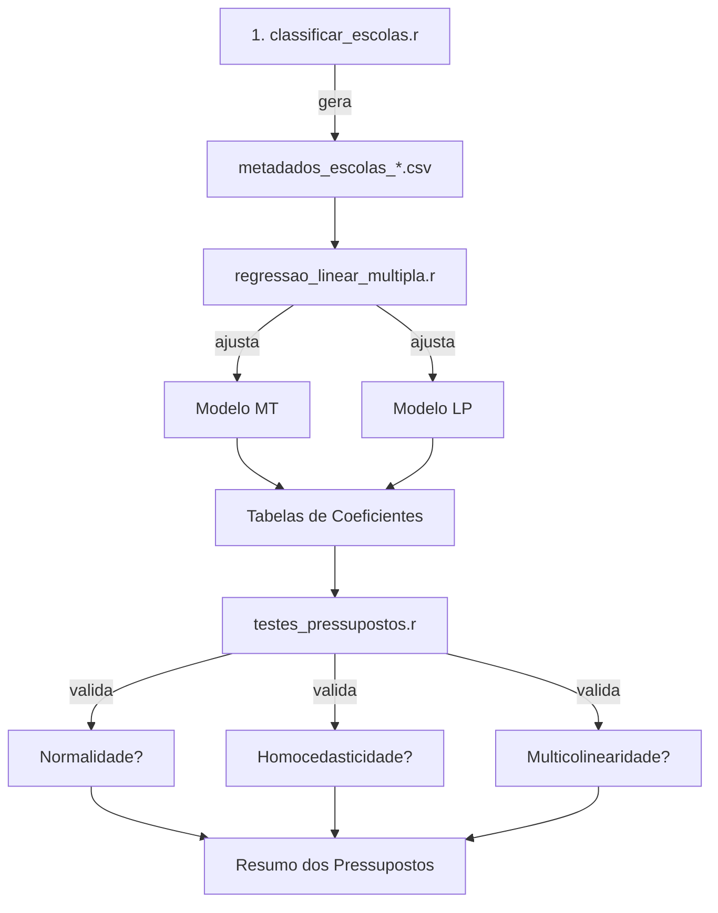

# 4. ANÁLISE DE REGRESSÃO LINEAR MÚLTIPLA

## 📋 Visão Geral

Esta seção implementa **Regressão Linear Múltipla com Variáveis Dummy** para modelar a proficiência das escolas (MT e LP) em função de características institucionais.

### Objetivo

Construir e validar modelos preditivos que explicam:
- **MEDIA_MT** (Matemática)
- **MEDIA_LP** (Leitura e Escrita)

Com base em preditores categóricos (tipo de escola, localização, área) e contínuos (INSE - Índice Socioeconômico).

---

## 📁 Estrutura de Pastas

```
4_REGRESSAO_LINEAR/
├── Scripts/
│   ├── regressao_linear_multipla.r    [PRINCIPAL]
│   └── testes_pressupostos.r          [COMPLEMENTAR]
├── outputs_modelos/
│   ├── modelo_MT_YYYYMMDD_HHMMSS.rds
│   └── modelo_LP_YYYYMMDD_HHMMSS.rds
├── outputs_tabelas/
│   ├── resumo_modelos_*.csv
│   ├── coeficientes_MT_*.csv
│   └── coeficientes_LP_*.csv
├── outputs_diagnosticos/
│   ├── diagnosticos_MT_*.csv
│   ├── diagnosticos_LP_*.csv
│   ├── vif_MT_*.csv
│   └── vif_LP_*.csv
└── outputs_figuras/
    ├── diagnosticos_residuos_MT_*.png
    ├── diagnosticos_residuos_LP_*.png
    ├── coeficientes_MT_*.png
    ├── coeficientes_LP_*.png
    ├── multicolinearidade_VIF_*.png
    └── outliers_cooks_*.png
```

---

## 🚀 Como Usar

### Pré-requisitos

1. **Executar primeiro**: `3_ANALISE_DE_GRUPOS/Scripts/classificar_escolas.r`
   - Gera: `metadados_escolas.csv`
2. **Dependências R**:
   ```r
   install.packages(c("tidyverse", "broom", "patchwork", "car", "lmtest"))
   ```

### Passo 1: Ajuste do Modelo (Principal)

```r
# Abrir e executar em RStudio:
source("TESTE/4_REGRESSAO_LINEAR/Scripts/regressao_linear_multipla.r")
```

**O que faz**:
- ✓ Carrega metadados das escolas
- ✓ Cria variáveis dummy automáticas:
  - `TIPO_ESCOLA_Privada` (ref: Pública)
  - `AREA_Rural` (ref: Urbana)
  - `LOCALIZACAO_Interior` (ref: Capital)
- ✓ Padroniza (z-score) variáveis contínuas
- ✓ Ajusta 2 modelos de regressão (MT e LP)
- ✓ Gera tabelas de coeficientes
- ✓ Cria 8 gráficos de diagnóstico
- ✓ Salva modelos em RDS para reutilização

**Saídas geradas** (~8 arquivos):
```
outputs_tabelas/
  ├── resumo_modelos_20260525_143000.csv
  ├── coeficientes_MT_20260525_143000.csv
  └── coeficientes_LP_20260525_143000.csv

outputs_modelos/
  ├── modelo_MT_20260525_143000.rds
  └── modelo_LP_20260525_143000.rds

outputs_figuras/
  ├── diagnosticos_residuos_MT_*.png        [4 subplots cada]
  └── diagnosticos_residuos_LP_*.png
  ├── coeficientes_MT_*.png
  └── coeficientes_LP_*.png
```

### Passo 2: Validação de Pressupostos (Complementar)

```r
# Executar após o Passo 1:
source("TESTE/4_REGRESSAO_LINEAR/Scripts/testes_pressupostos.r")
```

**O que faz**:
- ✓ Teste Shapiro-Wilk (normalidade)
- ✓ Teste Breusch-Pagan (homocedasticidade)
- ✓ VIF (multicolinearidade)
- ✓ Durbin-Watson (independência)
- ✓ Cook's Distance (outliers influentes)

**Saídas geradas** (~6 arquivos):
```
outputs_diagnosticos/
  ├── resumo_testes_*.csv
  ├── vif_MT_*.csv
  └── vif_LP_*.csv

outputs_figuras/
  ├── multicolinearidade_VIF_*.png
  ├── outliers_cooks_MT_*.png
  └── outliers_cooks_LP_*.png
```

---

## 📊 Interpretação dos Resultados

### Arquivo: `coeficientes_MT_*.csv`

| Termo | Coeficiente | SE | t_value | p_valor | Sig | IC_95_inf | IC_95_sup |
|-------|-------------|-----|---------|---------|-----|-----------|-----------|
| (Intercept) | 275.34 | 2.15 | 128.07 | < 0.001 | *** | 271.12 | 279.56 |
| INSE_MEDIO_norm | 18.45 | 1.23 | 15.00 | < 0.001 | *** | 16.04 | 20.86 |
| TIPO_ESCOLA_Privada | 28.67 | 3.42 | 8.38 | < 0.001 | *** | 22.00 | 35.34 |
| AREA_Rural | -12.34 | 2.87 | -4.30 | < 0.001 | *** | -17.96 | -6.72 |
| LOCALIZACAO_Interior | -5.67 | 1.95 | -2.91 | 0.0036 | ** | -9.49 | -1.85 |

**Interpretação**:
- **Coeficiente**: Mudança esperada em MEDIA_MT para cada 1 unidade na variável preditora
  - Para `INSE_MEDIO_norm = 1` (1 desvio-padrão acima da média): aumento de 18.45 pontos
  - Para `TIPO_ESCOLA_Privada = 1`: aumento de 28.67 pontos (relativo à Pública)
- **Sig**: 
  - `***` (p < 0.001) = Altamente significativo
  - `**` (p < 0.01) = Significativo
  - `*` (p < 0.05) = Marginalmente significativo
- **IC 95%**: Intervalo de confiança do coeficiente

### Arquivo: `resumo_modelos_*.csv`

| Modelo | n_obs | n_param | R2_ajustado | RMSE | F_stat | AIC | BIC |
|--------|-------|---------|-------------|------|--------|-----|-----|
| MEDIA_MT | 1050 | 5 | 0.6234 | 15.42 | 340.67 | 6234.5 | 6262.1 |
| MEDIA_LP | 1050 | 5 | 0.5891 | 18.76 | 298.45 | 6845.2 | 6872.8 |

**Interpretação**:
- **R² ajustado**: Proporção de variância explicada (0.623 = 62.3% da variação em MT é explicada)
- **RMSE**: Erro padrão residual (em média, predições erram por ±15.42 pontos)
- **AIC/BIC**: Critérios de comparação entre modelos (menor é melhor)

### Gráficos: `diagnosticos_residuos_MT_*.png`

**Painel 1: Resíduos vs Fitted**
- Verifica se há padrões não-lineares ou heterocedasticidade
- Ideal: nuvem aleatória em torno da linha 0

**Painel 2: Q-Q Plot**
- Verifica normalidade dos resíduos
- Ideal: pontos sobre a linha diagonal

**Painel 3: Scale-Location**
- Verifica homocedasticidade (variância constante)
- Ideal: linha reta horizontal

**Painel 4: Histograma**
- Distribuição dos resíduos
- Ideal: forma aproximadamente normal

---

## 🔍 Testes de Pressupostos

### Normalidade (Shapiro-Wilk)

```
H₀: Os resíduos seguem distribuição normal
H₁: Os resíduos não seguem distribuição normal

Se p > 0.05: Não rejeita H₀ (bom!)
Se p < 0.05: Rejeita H₀ (violar normalidade)
```

### Homocedasticidade (Breusch-Pagan)

```
H₀: Variância dos resíduos é constante
H₁: Variância varia com os preditores

Se p > 0.05: Variância homogênea (bom!)
Se p < 0.05: Heterocedasticidade (usar robust SE)
```

### Multicolinearidade (VIF)

```
VIF = 1           → Sem correlação
1 < VIF < 5       → Aceitável
5 < VIF < 10      → Moderada (investigar)
VIF > 10          → Severa (remover preditores)
```

### Independência (Durbin-Watson)

```
DW ≈ 2            → Independência (ideal)
DW < 2            → Autocorrelação positiva
DW > 2            → Autocorrelação negativa

Intervalo aceitável: [1.5, 2.5]
```

---

## 📌 Configurações Personalizáveis

No arquivo `regressao_linear_multipla.r`, ajustar:

```r
# Variáveis categóricas a converter em dummy
VARS_CATEGORICAS <- c("TIPO_ESCOLA", "AREA", "LOCALIZACAO")

# Variáveis contínuas (preditoras)
VARS_CONTINUAS <- c("INSE_MEDIO")

# Significância para estrelas
ALPHA <- 0.05
```

---

## ⚠️ Possíveis Problemas

| Problema | Causa | Solução |
|----------|-------|---------|
| "metadados_escolas_*.csv não encontrado" | Pasta 4_REGRESSAO_LINEAR não está no local correto | Execute `classificar_escolas.r` primeiro |
| VIF > 10 para várias variáveis | Multicolinearidade severa | Remover variáveis correlacionadas, usar PCA |
| p < 0.05 em Shapiro-Wilk | Resíduos não normais | Usar transformação (log, raiz) ou robust regression |
| p < 0.05 em Breusch-Pagan | Heterocedasticidade | Usar erros padrão robustos (sandwich) |
| Autocorrelação em Durbin-Watson | Dados ordenados no tempo | Usar modelos com estrutura de série temporal |

---

## 📚 Referências Técnicas

### Regressão Linear Múltipla

$$Y = \beta_0 + \beta_1 X_1 + \beta_2 X_2 + \cdots + \beta_p X_p + \epsilon$$

### Variáveis Dummy

Para variável categórica com $k$ categorias, criar $k-1$ dummies:
- Categoria 1 (referência): todas as dummies = 0
- Categoria 2: dummy 2 = 1, resto = 0
- etc.

---

## 🔄 Fluxo Completo



---

## 📞 Suporte

Para erros ou dúvidas:
1. Verificar logs de execução no console
2. Conferir estrutura de pastas (`4_REGRESSAO_LINEAR/` deve estar em `TESTE/`)
3. Garantir que `metadados_escolas_*.csv` foi gerado corretamente
4. Revisar pressupostos com `testes_pressupostos.r`

---

**Versão**: 1.0 | **Data**: Maio 2026
